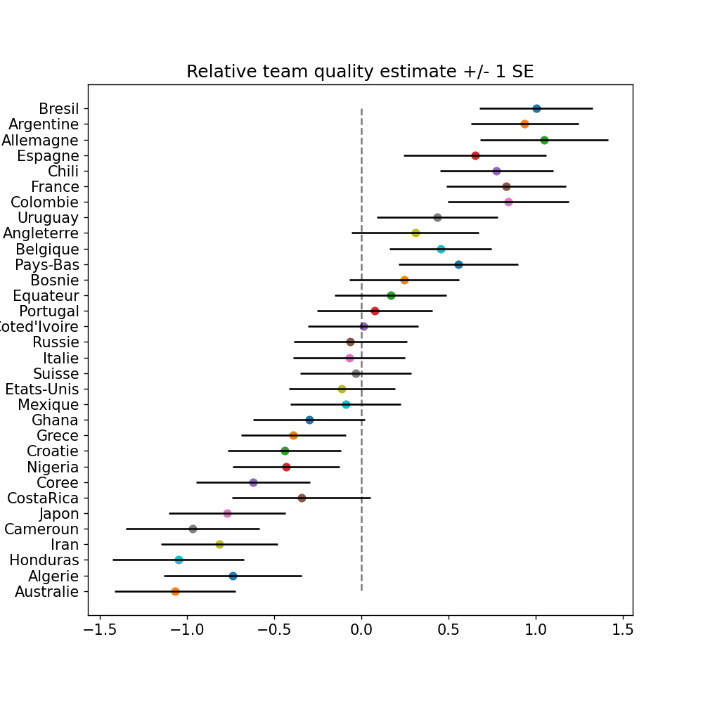

<h2 align="center">Bayesian modelling of the 2014 world cup</h2>

  <!--Python version -->
  
  <!--Project status -->
  
  <!--Commits  -->
  

 

### Overview
Repository containing Python and Stan code to run [Gelman's](https://statmodeling.stat.columbia.edu/2014/07/13/stan-analyzes-world-cup-data/) simple world cup model from 2014.

**Example of team quality estimated by the Bayesian model:**

### Getting started

Aside from standard data science packages the main dependencies are [PyStan](https://pystan.readthedocs.io/en/latest/) and [ArviZ](https://arviz-devs.github.io/arviz/).

### Notebooks

Notebooks are located in the `world_cup/notebooks` directory.

* `model_overview.ipynb`: an explanation of the model. 
* `fit_model.ipynb`: fits the model on a linear scale per Gelman.

### TODO

* Prior predictive checking
* Posterior predictive checking
* Model checking